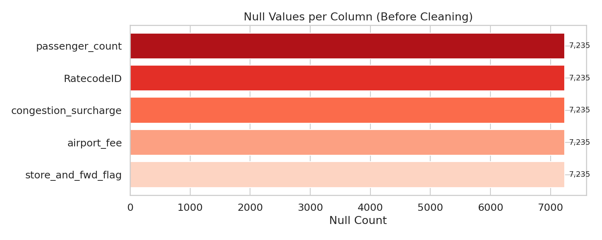
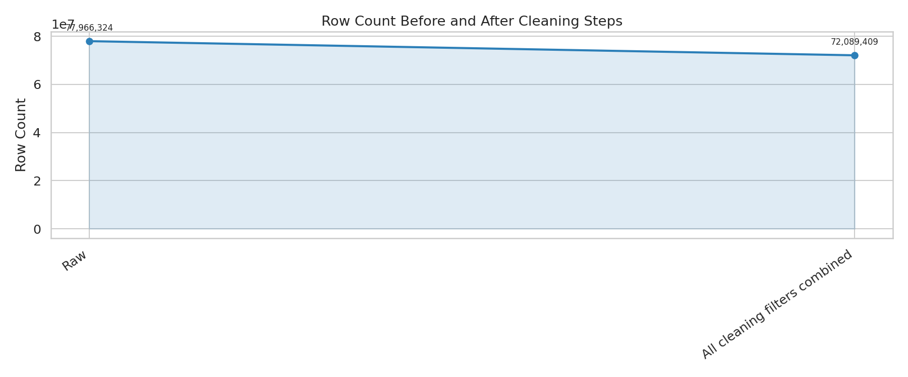
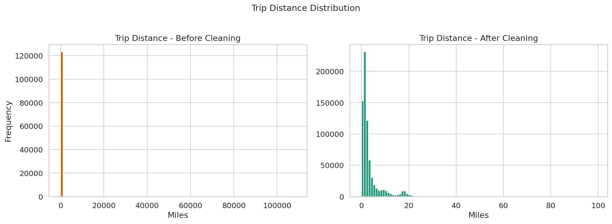
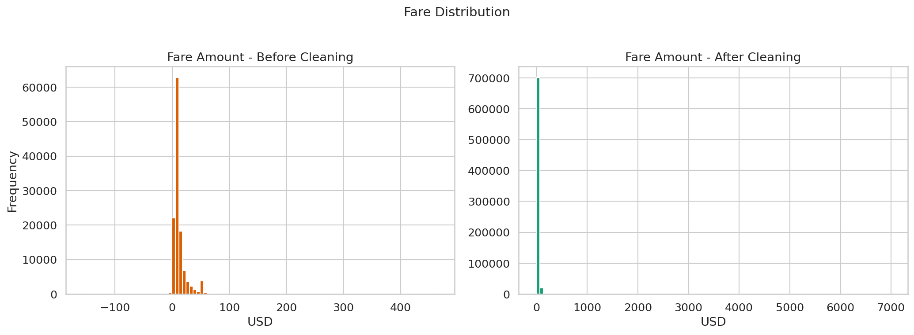

# Data Cleaning — Completed

**Who did this:** Srinidhi  
**Dataset:** NYC Yellow Taxi trip data — full years 2022 and 2023  
**Total raw records processed:** 77,966,324 (~78 million rows across 24 monthly files)

---

## What Was Done

The raw taxi data had a lot of problems — missing values, corrupt records, impossible trips, and schema differences between files from different months. All of that has been cleaned and the output is ready for the next stage of the pipeline.

Here is exactly what was applied:

**1. Schema standardisation**  
The 2022 and 2023 files were written with different column types (e.g. `VendorID` as INT in 2022 but BIGINT in 2023). All 24 files have been cast to a single unified schema so any downstream query works without type errors.

**2. Missing value handling**  
Nullable columns were filled with safe business defaults:
- `passenger_count` → `1` (solo rider assumed)
- `RatecodeID` → `1` (standard rate)
- `congestion_surcharge` and `airport_fee` → `0.0` (not applicable = zero charge)
- `store_and_fwd_flag` → `"N"` (normal online transaction)

**3. Invalid and corrupt record removal**  
Rows were dropped if they violated any of the following:
- Dropoff time is before or equal to pickup time
- Trip duration less than 1 minute or more than 3 hours
- Trip distance is 0, negative, or more than 100 miles
- Passenger count is 0 or more than 6
- Fare amount or total amount is less than $0.01
- VendorID, RatecodeID, or payment type is not a recognised valid code
- Pickup year is not 2022 or 2023 (catches timestamp corruption)

**4. New columns added (feature engineering)**  
These columns were derived and added to the output for easier analysis:

| New Column | What it is |
|------------|------------|
| `trip_duration_mins` | How long the trip took in minutes |
| `pickup_hour` | Hour of day the trip started (0–23) |
| `pickup_day_of_week` | Day of the week (1=Sunday, 7=Saturday) |
| `pickup_month` | Month number (1–12) |
| `is_weekend` | True if the pickup was on Saturday or Sunday |
| `speed_mph` | Average speed calculated from distance and duration |
| `payment_type_label` | Human-readable label (e.g. "Credit Card", "Cash") |
| `ratecode_label` | Human-readable label (e.g. "Standard", "JFK", "Newark") |
| `vendor_label` | Vendor name (Creative Mobile Technologies or VeriFone Inc.) |
| `day_name` | Day name as text (e.g. "Monday", "Tuesday") |

---

## Results

| | Count |
|--|-------|
| Raw records | 77,966,324 |
| Cleaned records | 72,089,409 |
| Records removed | 5,876,915 |
| Reduction | 7.54% |

The full breakdown is in [`cleaning_report.md`](cleaning_report.md).

---

## Visual Proof

All four charts below are in the `docs/charts/` folder.

### Null Values Before Cleaning
Shows which columns had missing data and how many.



---

### Row Count — Before vs After Cleaning
Shows how many rows were removed overall.



---

### Trip Distance Distribution
Left = raw data (includes outliers and zeroes). Right = after cleaning.



---

### Fare Amount Distribution
Left = raw data (includes $0 fares and corrupt values). Right = after cleaning.



---

## Where the Cleaned Data Lives

The cleaned output is stored in **HDFS** inside the Docker cluster — it is not in this Git repo (parquet files are gitignored).

**HDFS path:**
```
hdfs://namenode:9000/user/data/nyc_taxi/cleaned/
```

It is split into one folder per month:
```
cleaned/yellow_tripdata_2022-01/part-00000-*.snappy.parquet
cleaned/yellow_tripdata_2022-02/part-00000-*.snappy.parquet
...
cleaned/yellow_tripdata_2023-12/part-00000-*.snappy.parquet
```

---

## How to Access the Cleaned Data

### Browse it in the browser
Start the cluster and go to:  
**http://localhost:9870** → Utilities → Browse the file system → `/user/data/nyc_taxi/cleaned/`

### Query it with Spark
```bash
# Open a PySpark shell inside the cluster
docker exec -e PYSPARK_PYTHON=python3 -it nyc_taxi_cluster-spark-master-1 \
  /spark/bin/pyspark --master local[1]
```

Then run:
```python
df = spark.read.parquet("hdfs://namenode:9000/user/data/nyc_taxi/cleaned/yellow_tripdata_*")

# Check schema
df.printSchema()

# See a few rows
df.show(5)

# Total row count (should be ~72 million)
df.count()
```

### Re-run the pipeline yourself (if you don't have the HDFS data)
1. Start the Docker cluster: `docker compose up -d`
2. Make sure the raw parquet files are in HDFS at `hdfs://namenode:9000/user/data/nyc_taxi/raw/`
3. Stop the Spark worker to free memory: `docker stop nyc_taxi_cluster-spark-worker-1`
4. Run:
```bash
docker exec \
  -e PYSPARK_PYTHON=python3 \
  -e PYSPARK_DRIVER_PYTHON=python3 \
  nyc_taxi_cluster-spark-master-1 \
  /spark/bin/spark-class org.apache.spark.deploy.SparkSubmit \
  --master 'local[1]' \
  --driver-memory 2200m \
  --driver-java-options '-XX:MaxDirectMemorySize=256m -XX:MaxMetaspaceSize=256m' \
  --conf spark.sql.shuffle.partitions=12 \
  --conf spark.default.parallelism=12 \
  --conf 'spark.sql.parquet.enableVectorizedReader=false' \
  --conf spark.memory.fraction=0.6 \
  --conf spark.memory.storageFraction=0.1 \
  /workspace/jobs/run_pipeline.py
```

The pipeline supports **resume** — if it gets interrupted, re-running it will automatically skip months that are already done.

---

## Pipeline Code

All the cleaning logic is in the `jobs/` folder:

| File | What it does |
|------|-------------|
| `run_pipeline.py` | Main entry point — orchestrates everything |
| `schema.py` | Defines the unified target schema |
| `cleaning.py` | All the filtering and null-filling logic |
| `feature_engineering.py` | Adds the derived columns |
| `io_utils.py` | Reads/writes to HDFS and MySQL |
| `visualizations.py` | Generates the before/after charts |

Configuration (HDFS paths, cleaning thresholds, MySQL details) is all in `config/pipeline_config.yaml`.
