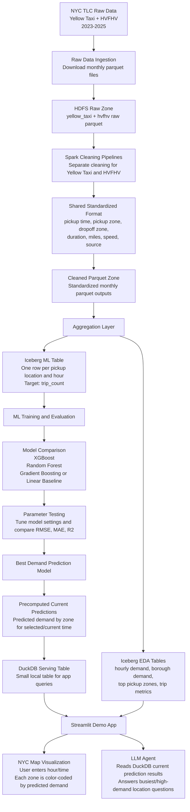

# NYC Taxi Demand Prediction Architecture Summary

## Project Goal

The project predicts taxi and high-volume for-hire vehicle demand in New York City using 2023-2025 NYC TLC trip data. The ML model predicts demand based on pickup location and time, then the Streamlit demo displays predicted business level on a NYC map.

The main prediction target is:

```text
pickup location + time information -> predicted trip_count
```

In plain terms, the model answers:

> For a selected pickup zone and hour, how many trips are expected?

## Architecture



## Data Flow

1. Ingest raw TLC monthly parquet files for both Yellow Taxi and HVFHV from 2023-2025.
2. Store raw files in HDFS by source.
3. Clean Yellow Taxi and HVFHV separately because their raw schemas are different.
4. Convert both cleaned datasets into a shared standardized schema.
5. Save cleaned standardized parquet files.
6. Aggregate cleaned data into Iceberg tables for EDA and ML.
7. Train and compare multiple ML models using the Iceberg ML table.
8. Save the best model.
9. Precompute current or selected-time predictions for all NYC pickup zones.
10. Save the current prediction output to a small DuckDB serving table.
11. Streamlit reads DuckDB and shows a color-coded NYC map.
12. The LLM agent reads the same DuckDB current prediction result to answer user questions.

## ML Iceberg Table

The ML table should contain one row per location and time bucket. The model uses location and time columns as input and predicts `trip_count`.

```sql
CREATE TABLE nyc.taxi_demand_ml (
  source_id INT,
  source_name STRING,
  PULocationID BIGINT,
  pickup_year INT,
  pickup_month INT,
  pickup_day_of_week INT,
  pickup_hour INT,
  is_weekend BOOLEAN,
  trip_count BIGINT
)
USING iceberg;
```

### Column Meaning

| Column | Meaning |
| --- | --- |
| `source_id` | Numeric source identifier, for example `0 = yellow`, `1 = hvfhv` |
| `source_name` | Source name, such as `yellow` or `hvfhv` |
| `PULocationID` | NYC pickup taxi zone ID |
| `pickup_year` | Pickup year, used for train/test split |
| `pickup_month` | Month of year |
| `pickup_day_of_week` | Day of week |
| `pickup_hour` | Hour of day, from `0` to `23` |
| `is_weekend` | Whether the pickup is on Saturday or Sunday |
| `trip_count` | Demand target: number of trips for that source, zone, and time bucket |

## ML Model Plan

The model input columns are:

```text
source_id
PULocationID
pickup_month
pickup_day_of_week
pickup_hour
is_weekend
```

The prediction target is:

```text
trip_count
```

Recommended model comparison:

| Model | Purpose |
| --- | --- |
| XGBoost Regressor | Main strong model for demand prediction |
| Random Forest Regressor | Tree-based comparison model |
| Gradient Boosting or Linear Regression baseline | Additional comparison model |

Recommended evaluation metrics:

| Metric | Purpose |
| --- | --- |
| RMSE | Penalizes large prediction errors |
| MAE | Shows average absolute prediction error |
| R2 | Shows how much demand variation the model explains |

Recommended split:

```text
Train: 2023-2024
Test: 2025
```

## Current Prediction Table for Streamlit and LLM Agent

After choosing the best model, the app should generate or load current predictions for all pickup zones. Both the map and the LLM agent should read this same precomputed result.

For the main data pipeline, Iceberg is still the right storage layer for the aggregated ML and EDA tables. For the Streamlit demo, DuckDB is a better serving store because the current prediction result is small, local, fast to query, and easy for the app and LLM agent to read.

Recommended DuckDB table:

```sql
CREATE TABLE current_taxi_demand_predictions (
  prediction_timestamp TIMESTAMP,
  source_id INTEGER,
  source_name VARCHAR,
  PULocationID BIGINT,
  borough VARCHAR,
  zone VARCHAR,
  pickup_month INTEGER,
  pickup_day_of_week INTEGER,
  pickup_hour INTEGER,
  predicted_trip_count DOUBLE,
  demand_level VARCHAR
);
```

The `demand_level` column can be derived from `predicted_trip_count`, for example:

```text
low
medium
high
very_high
```

Recommended serving flow:

```text
Best ML model
-> generate predictions for all NYC pickup zones for the selected/current time
-> save predictions into DuckDB
-> Streamlit reads DuckDB
-> NYC map and LLM agent use the same current prediction table
```

This keeps the app layer simple. Spark and Iceberg handle the larger historical data and training tables, while DuckDB handles the small prediction table used by the live demo.

## Streamlit Demo

The Streamlit app should allow the user to choose:

- Data source: Yellow Taxi, HVFHV, or combined
- Month
- Day of week
- Hour of day

The app should then:

- Predict demand for each NYC pickup zone
- Join predictions with taxi zone map geometry
- Color-code each zone by predicted demand level
- Show top high-demand zones in a table
- Let the LLM agent answer questions based on the current prediction output

Example LLM questions:

- Where is the busiest place right now?
- Which pickup zones have the highest predicted demand?
- Which borough has the most high-demand zones?
- Compare Yellow Taxi and HVFHV demand for this selected time.

## Important Design Decision

The LLM agent should not directly analyze raw parquet files, query the full Iceberg warehouse, or retrain the model. It should read the current prediction table in DuckDB that was already generated by the model. This keeps the app faster, simpler, and consistent with the map shown to the user.
